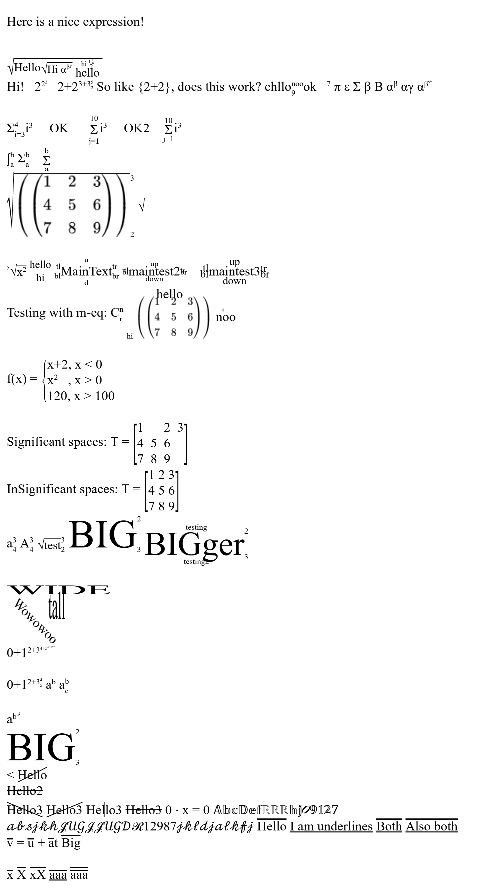

# MathToHTML

This is a pure js, client side library, designed to allow writing latex-like equations, and have them being rendered nicely (in the form of div and span elements).

The rendered equations are not images, but still text elements, so they are selectable as text.

## Usage
Just import the library by
```html
<script src="https://cdn.jsdelivr.net/gh/TejasIsCool/MathToHTML@v0.1.1/dist/math-eq.min.js" defer></script>
```
in your html file.
(Or you can download the `dist/math-eq.min.js` and import it with defer).

Then you can use the library by writing
```html
<m-eq>2^{2^3}</m-eq>
```
And it will replace your latex expression with the rendered expression.
(in this case,  )

By default, the \<m-eq> tag will preserve whitespaces in the text, so its easier to format.
If you don't want that, you may use the \<m-eqi> tag.


## Documentation
Under Construction\
Some examples of using this can be found in [index.html](./index.html)\
Here is how the example file renders as \

